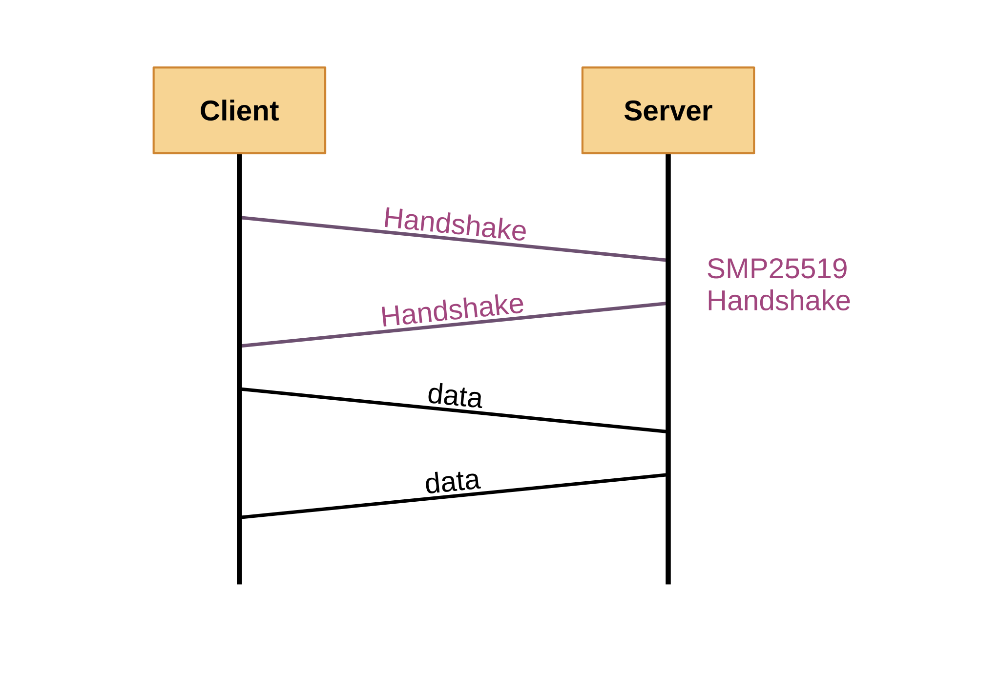

# SMP25519 | Secure Messaging Protocol 25519 | TypeScript & JavaScript

## Overview
SMP25519 is designed to facilitate secure communication using the X25519 key exchange, BLAKE3 hashing, and ChaCha20 encryption. It provides a straightforward interface for generating secure identities, creating handshake messages, deriving shared secrets, and encrypting/decrypting data.
## Installation
```
npm install smp25519
```
## Dependencies
SMP25519 uses the following dependencies:
- [@noble/ciphers](https://www.npmjs.com/package/@noble/ciphers)
- [@noble/curves](https://www.npmjs.com/package/@noble/curves)
- [@noble/hashes](https://www.npmjs.com/package/@noble/hashes)
## License
This package is distributed under the [Unlicense](https://choosealicense.com/licenses/unlicense/).
## Contact
For support or inquiries, contact truebreaker@proton.me.
# Examples
## Client
```typescript
import * as smp25519 from "smp25519";
import dgram from "dgram";
import { exit } from "process";
import * as base64 from "js-base64"

function stringToUint8Array(input: string): Uint8Array {
    const encoder = new TextEncoder();
    return encoder.encode(input);
}

function uint8ArrayToString(input: Uint8Array): string {
    const decoder = new TextDecoder();
    return decoder.decode(input);
}

/*
 * Secure UDP client example using the smp25519 package.
 * This script demonstrates how to establish a secure communication channel with a server using key exchange and encryption.
 */
function main() {
    // Step 1: Generate client identity (private key, public key, and connection ID).
    const { privateKey, publicKey, connectionId } = smp25519.generateIdentity();

    // Step 2 (RECOMMENDED): Define the server's known public key (Base64 encoded).
    let knownServerPublicKey = base64.toUint8Array("Vh4DBTYyDbwTqg1eZzTnuTxThscIoNQgLpxgsBCOFCU=");

    // Step 3: Create a UDP socket.
    const socket = dgram.createSocket("udp4");
    const SERVER_HOST = "localhost";
    const SERVER_PORT = 12000;

    console.log(`Secure UDP Client: Attempting connection to ${SERVER_HOST}:${SERVER_PORT}.`);

    // Variables to store server-specific connection data.
    let serverPublicKey: Uint8Array;
    let sharedSecret: Uint8Array;

    // Message handler
    socket.on("message", (msg, rinfo) => {
        // Step 5: Receive and validate handshake response from the server.
        if (smp25519.isHandshakeMessage(msg) == true) {
            // Extract the server's public key from the handshake message.
            serverPublicKey = smp25519.extractPublicKeyFromHandshake(msg);

            // (RECOMMENDED) Verify the server's public key.
            if (serverPublicKey.every((val, index) => val !== knownServerPublicKey[index])) {
                console.error("Error: Known server public key mismatch. Aborting connection.");
                exit(-1);
            }

            // Step 6: Derive the shared secret using the server's public key and a salt.
            // sharedSecret = smp25519.deriveSharedSecret(privateKey, serverPublicKey, "examplesalt");
            sharedSecret = smp25519.deriveSharedSecret(privateKey, serverPublicKey);

            // Send something.
            socket.send(smp25519.encryptAndSendData(connectionId, stringToUint8Array("Hello from Client!"), sharedSecret), SERVER_PORT, SERVER_HOST, (err) => {
                if (err) {
                    console.error(`Error: Unable to send message for reason: ${err}`)
                    exit(-1);
                }
            });

            return;
        }

        // Receive and decrypt the server's response.
        if (smp25519.isValidData(msg) == true && sharedSecret.length > 0) {
            const decryptedMessage = smp25519.decryptReceivedData(msg, sharedSecret);
            console.log(`Server response from ${rinfo.address}:${rinfo.port}: ${uint8ArrayToString(decryptedMessage)}`);

            return;
        }

        console.error(`Error: Unknown message from ${rinfo.address}:${rinfo.port}`)
        exit(-1);
    });

    // Step 4: Send handshake message containing the client's public key.
    socket.send(smp25519.createHandshakeMessage(publicKey), SERVER_PORT, SERVER_HOST, (err) => {
        if (err) {
            console.error(`Error: Unable to send handshake message for reason: ${err}`)
            exit(-1);
        }
    });
}

main();
```
## Server
```typescript
import * as smp25519 from "smp25519";
import dgram from "dgram";
import { exit } from "process";
import * as base64 from "js-base64"

function stringToUint8Array(input: string): Uint8Array {
    const encoder = new TextEncoder();
    return encoder.encode(input);
}

function uint8ArrayToString(input: Uint8Array): string {
    const decoder = new TextDecoder();
    return decoder.decode(input);
}

/*
 * Secure UDP server example using the smp25519 package.
 * This script demonstrates how to establish a secure communication channel with a single
 * client at a time using key exchange and encryption.
 */
function main() {
    // Step 1: Generate the server's identity.
    // const { privateKey, publicKey, connectionId } = smp25519.generateIdentity();

    // Or use a pre-existing private key (Base64 encoded) and derive the public key.
    const privateKey = base64.toUint8Array("4Pe2QvF6zk41OWkMTqVR8e9nvwhbOEaDRti6oykaG18=");
    const publicKey = smp25519.getPublicKeyFromPrivate(privateKey);
    console.log(`Server public key (Base64): ${base64.fromUint8Array(publicKey)}`);

    // Step 2: Set up the UDP socket.
    const socket = dgram.createSocket("udp4");
    const SERVER_PORT = 12000;

    console.log(`Secure UDP Server: Listening on port ${SERVER_PORT}`);

    // Variables to store client-specific connection data.
    let clientConnectionId: Uint8Array;
    let clientSharedSecret: Uint8Array;

    // Step 3: Main server loop.
    socket.on("message", (msg, rinfo) => {
        // Step 4: Handle handshake messages.
        if (smp25519.isHandshakeMessage(msg) == true) {
            console.log(`Handshake received from ${rinfo.address}:${rinfo.port}`);

            // Extract the client's public key and generate a connection ID.
            const clientPublicKey = smp25519.extractPublicKeyFromHandshake(msg);
            clientConnectionId = smp25519.generateConnectionIdFromPublicKey(clientPublicKey);

            // Derive a shared secret using the client's public key and a salt.
            // clientSharedSecret = smp25519.deriveSharedSecret(privateKey, clientPublicKey, "examplesalt");
            clientSharedSecret = smp25519.deriveSharedSecret(privateKey, clientPublicKey);

            // Respond with the server's handshake message.
            socket.send(smp25519.createHandshakeMessage(publicKey), rinfo.port, rinfo.address, (err) => {
                if (err) {
                    console.error(`Error: Unable to send handshake message for reason: ${err}`)
                    exit(-1);
                }
            });

            return;
        }

        // Step 5: Handle encrypted messages.
        if (smp25519.isValidData(msg) == true && clientSharedSecret.length > 0) {
            // Verify the connection ID matches the client.
            if (smp25519.extractConnectionIdFromData(msg).every((val, index) => val !== clientConnectionId[index])) {
                console.log(`Notice: Unknown client ID from ${rinfo.address}:${rinfo.port}. Ignoring message.`);
                return;
            }

            // Decrypt the received message.
            const decryptedMessage = smp25519.decryptReceivedData(msg, clientSharedSecret);
            console.log(`Message from ${rinfo.address}:${rinfo.port}: ${uint8ArrayToString(decryptedMessage)}`);

            // Send an encrypted response back to the client.
            const responseMessage = "Hello from Server!";
            const encryptedMessage = smp25519.encryptAndSendData(clientConnectionId, stringToUint8Array(responseMessage), clientSharedSecret);
            socket.send(encryptedMessage, rinfo.port, rinfo.address, (err) => {
                if (err) {
                    console.error(`Error: Unable to send handshake message for reason: ${err}`)
                    exit(-1);
                }
            });
            console.log("Response sent.");

            return;
        }

        // Step 6: Handle unrecognized data.
        console.log(`Notice: Received unknown data from ${rinfo.address}:${rinfo.port}`);
    });

    // Bind to port
    socket.bind(SERVER_PORT);
}

main();
```